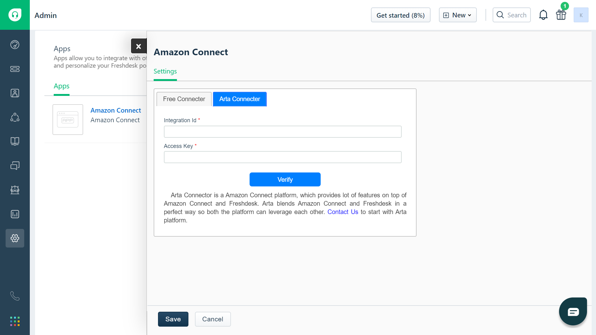

<!-- # Connector for Freshsales -->

### Introduction

Arta Connector blends Amazon Connect and Freshsales in a perfect way so both the platform can leverage each other.

### Features

- Search CRM contacts within the app
- Save a contact
- Identify caller details based on CRM  
- Display Open tickets based on caller details
- Create a New ticket while on call
- Add manual phone logs for the call
- Quick Connects is easily accessible
- Call timer and Queue Name are displayed

<!-- | Free Connector        | Paid Connector           |
| ------------- |:-------------:|
| Call Logs      | Call Logs |
| Contacts with search      | Contacts with search      |
| Save contact | Save contact      |
|  | Multilanguage     | -->

### Free Connector Installation


- **Instance URL** - Enter Amazon Connect Instance URL

  **NOTE**
  If the domain Name ends with `.awsapps.com` include `/connect`

  ```text
  eg: https://sandeza.awsapps.com/connect
  ```

  **NOTE**
  If the domain Name ends with `.my.connect.aws` do not include `/connect`

  ```text
  eg: https://sandeza.my.connect.aws
  ```

<!-- - **Instance Login URL** - Enter Amazon Connect Instance login URL. You can find that in Connect Instances overview page

  ```text
  eg : https://sandeza.awsapps.com/connect/login
  ``` -->

- **Freshsales URL** - Enter your domain URL of freshsales where you are going to install the connector.

  > **Important** : Include `https://` in beginning and don't include `/` at last as shown below

  ```text
  eg : https://example.myfreshworks.com 

                   (or) 

  eg : https://example.freshdesk.com
  ```

- **Freshsales API Key** - Enter your Freshsales API Key.

  > **Important** : Respective user of API Key which was provided should have access to create ticket.

- **Amazon Connect Cloud Front URL** - Enter your domain URL of Amazon Connect Cloud Front.

  > **Important** : Include `https://` in beginning and don't include `/` at last as shown below

  ```text
  Cloud Front Url: https://d1s8z0m5zskcd9.cloudfront.net
  ```

  Once you filled all mandotery fields proceed to Install

<!-- ### Arta Connector Installation



- **Integration Id** - Enter Arta Freshsales integration id. You find your Freshsales integration id in arta platform under Freshsales Integrations

- **Access Key** - Enter Arta Freshsales access key. You find your Freshsales access key in arta platform under Freshsales Integrations -->
